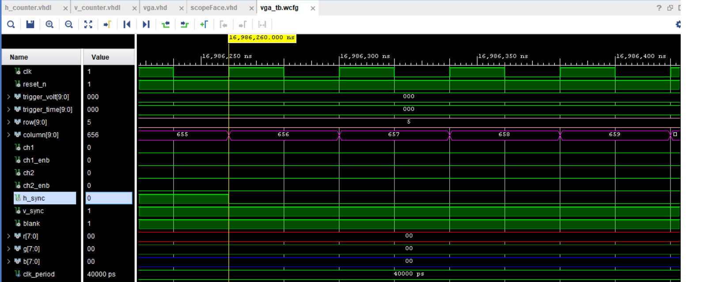
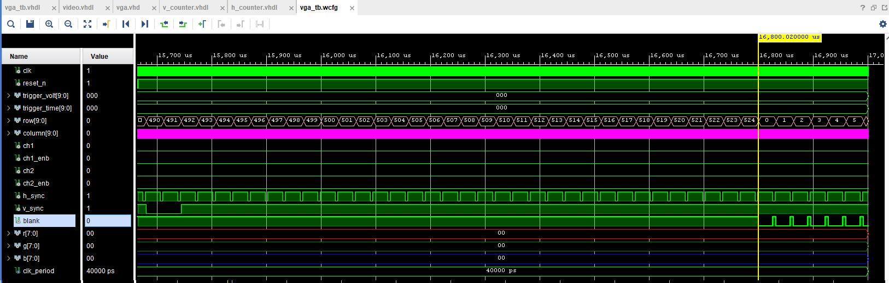

# Lab 1
## KokHwa Khor

## Table of Contents
1. [Objectives or Purpose](#objectives-or-purpose)
2. [Preliminary Design](#preliminary-design)
3. [Software flow chart](#software-flow-chart)
4. [Hardware schematic](#hardware-schematic)
5. [Debugging](#debugging)
6. [Testing methodology or results](#testing-methodology-or-results)
7. [Answers to Lab Questions](#answers-to-lab-questions)
8. [Observations and Conclusions](#observations-and-conclusions)
9. [Documentation](#documentation)

### Objectives or Purpose 
In this lab, a VGA controller was written in VHDL and implemented on the FPGA development board. A VGA-to-HDMI module that will automatically format the output for the HDMI output port on the development board was used. This VGA controller will be tasked to generate the display portion of an oscilloscope. The scope face consists of a white grid, used to measure the signals, two trigger markers, and the waveforms. In this lab, the waveforms will be artificially generated by the code.

### Preliminary design
#### Figure below shows a sketch of the oscilloscope.

#### Figure 1: Detailed diagram of the oscilloscope.

#### Figure below shows a detailed sketch of the nine pixels of the trigger volt and trigger time mark in reference to tr_volt and tr_time signals.

#### Figure 2: Draft of the 9 pixels for trigger volt mark and trigger time mark.

#### Figure below shows the durations and counts of the h_sync and v_sync signals.

#### Figure 3: Durations and counts of the h_sync and v_sync signals.

### Software flow chart
One of the most important entity in this lab was the VGA entity. It includes two cascaded counters (row and column) which will generate v_sync, h_sync, h_blank, and v_blank signals according to the rows and columns. Both the h_blank and v_blank signals were logical OR together and sent to Scopeface entity. Scopeface entity generate pixel colors according to columns, rows, channel 1 and channel 2 traces. It is also responsible for plotting markers for trigger time and trigger volt from the corresponding tr_volt and tr_time inputs. This was achieved by generating the R,G,B values at the screen coordinate.

### Hardware schematic
#### Figure below shows an updated block diagram for this lab.

#### Figure 4: Schematic for the design.

### Debugging
1. I had to fix the appropriate v_synch, h_synch, and blank signals before it could output properly. A few rows or columns missing would cause the display to not work.
2. For some reason, when I was setting row 20 to draw a white line, my code never work on simulation. But when Professor Falkinburg tried the code that I uploaded on his laptop, it works perfectly. It took me a few hours to finally solve it by downloading my entire repository from bitbucket and replacing the old one.
3. When I tried to display the white line on my own monitor, it doesn't work and I thought it's because I was using HDMI-to-DVI cable. So I brought my code to the lab and tested but it still doesn't work. Strangely enough, it work on Professor Falkinburg's laptop again with the same code that I uploaded. I fixed it again by downloading the entire repository from bitbucket and replacing the old one.

### Testing methodology or results
#### Figure below shows column rollover at 799 and row rollover at 524.

#### Figure 5: Column and row rollover.

#### Figure 6 & 7 below shows h_sync signal going high and low in relation to h count at 655 and 751.

#### Figure 6: h_sync signal going low in relation to h count.

#### Figure 7: h_sync signal going high in relation to h count.

#### Figure below shows v_sync signal going high and low in relation to v count at 490 and 491.

#### Figure 8: v_sync signal going high and low in relation to v count.

#### Figure 9 & 10 below shows blank signal going high and low in relation to h count at 0 and 639.

#### Figure 9: blank signal going low in relation to h count.

#### Figure 10: blank signal going high in relation to h count.

#### Figure 11 & 12 below shows blank signal going high and low in relation to v count at 0 and 479.

#### Figure 11: blank signal going low in relation to v count.

#### Figure 12: blank signal going high in relation to v count.

#### Figure below shows a white line being displayed at row 20 on a monitor.

#### Figure 13: A horizontal line at row 20.

### Answers to Lab Questions
#### No questions were asked in this lab.

### Final Result
#### Figure below shows the final result of oscilloscope with required functionality.

#### Figure 14: Final result of oscilloscope for this lab with A level functionality.
#### [Video link to show functionality of buttons](https://unl.box.com/s/0z8my3ldint1amisvifeo2oef0grkfay)

### Observations and Conclusions
A VGA controller was built in VHDL and implemented on a FPGA development board. I learned more about how VGA works and how a display was outputted pixel by pixel. I also learned how to implement multiple entities for one project in VHDL. A deeper undestanding of VHDL code was achieved such as how to output certain color or debounce buttons. Overall, this lab was a success with both required and a-level functionality achieved as shown in Figure 14 and the video under it. The only thing that I could think of to improve this lab was maybe to make sure the monitor works with the development board because some monitors are finicky and sometimes it takes a lot of time to fix it.

### Documentation
This lab was done with the help of Professor Falkinburg and code from HW 4.