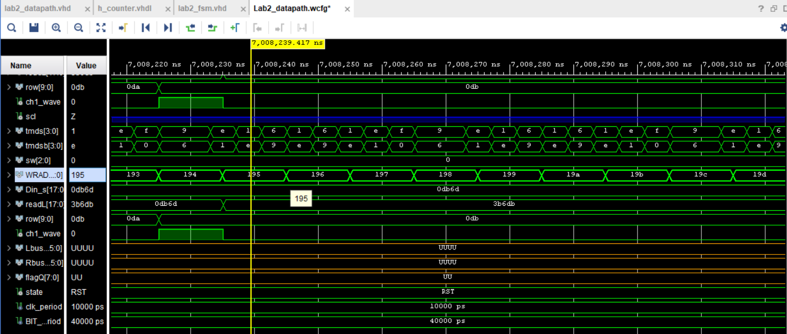
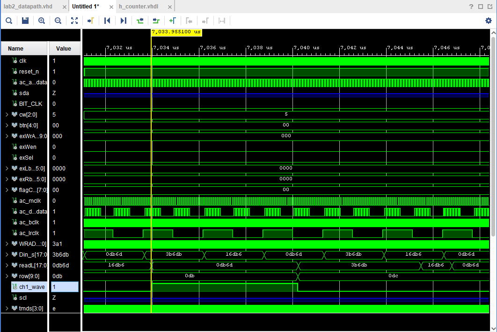
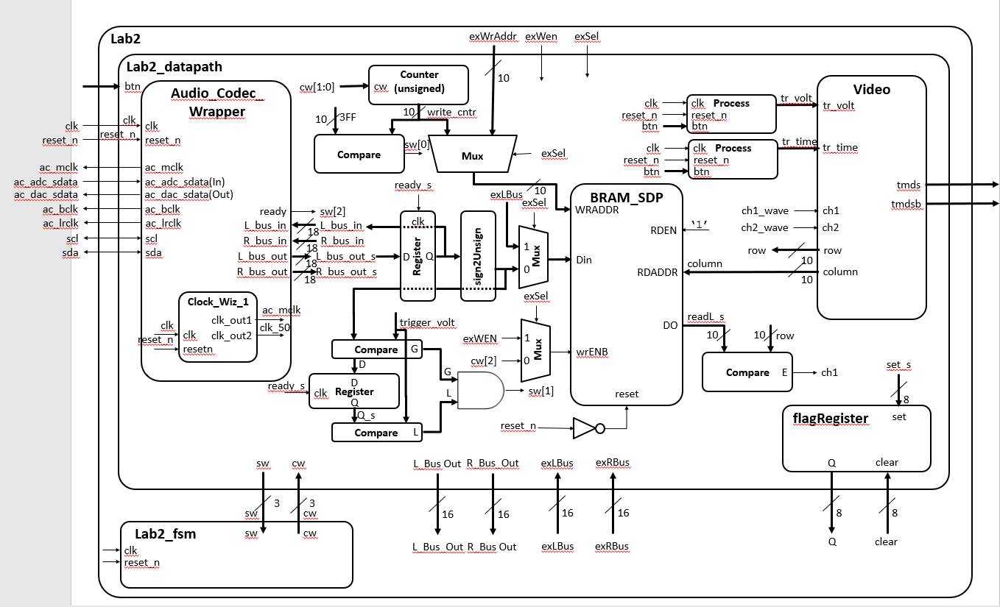
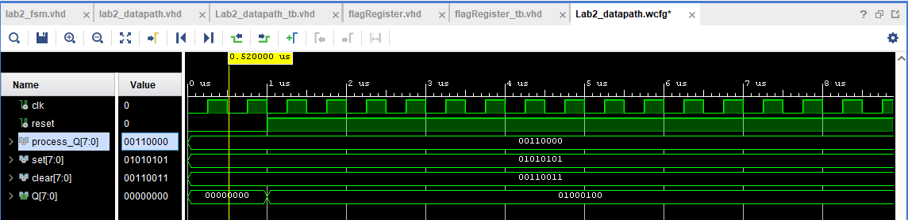
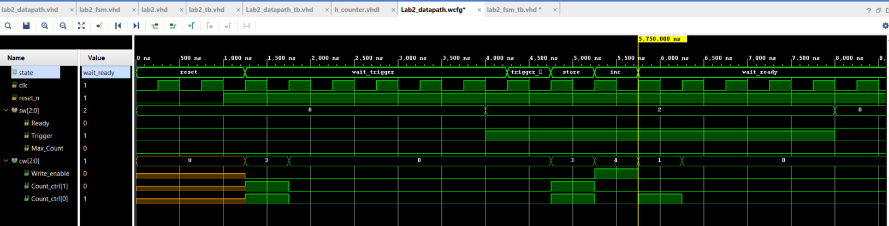
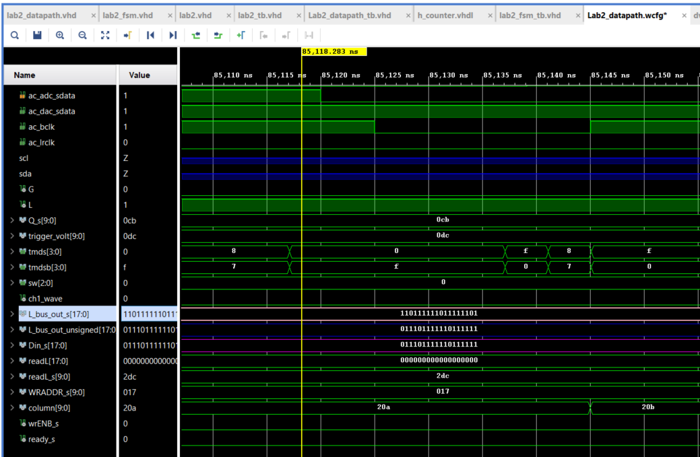
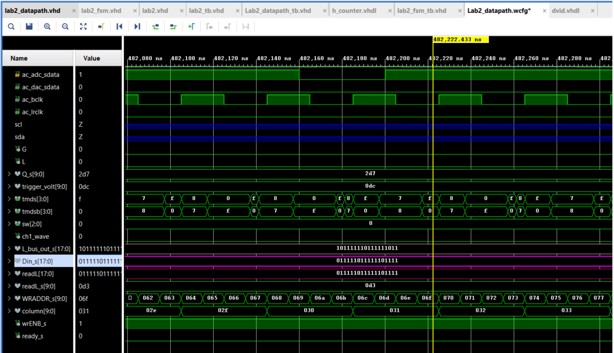
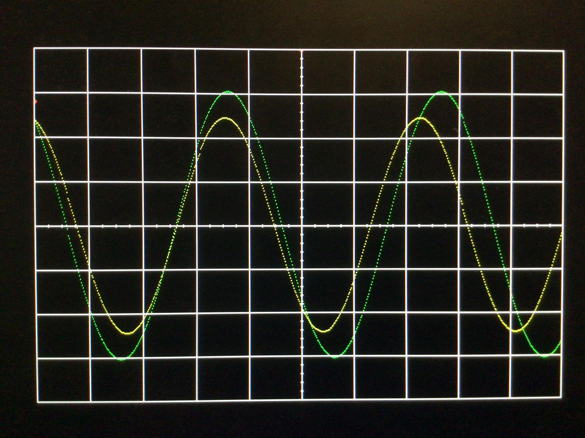
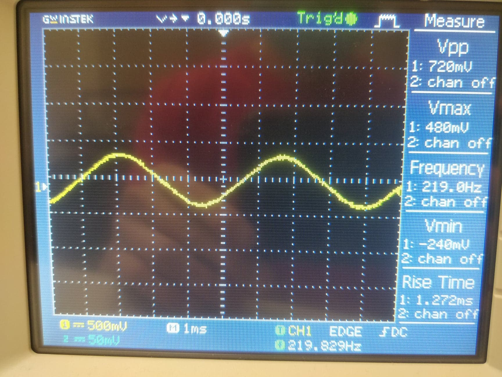
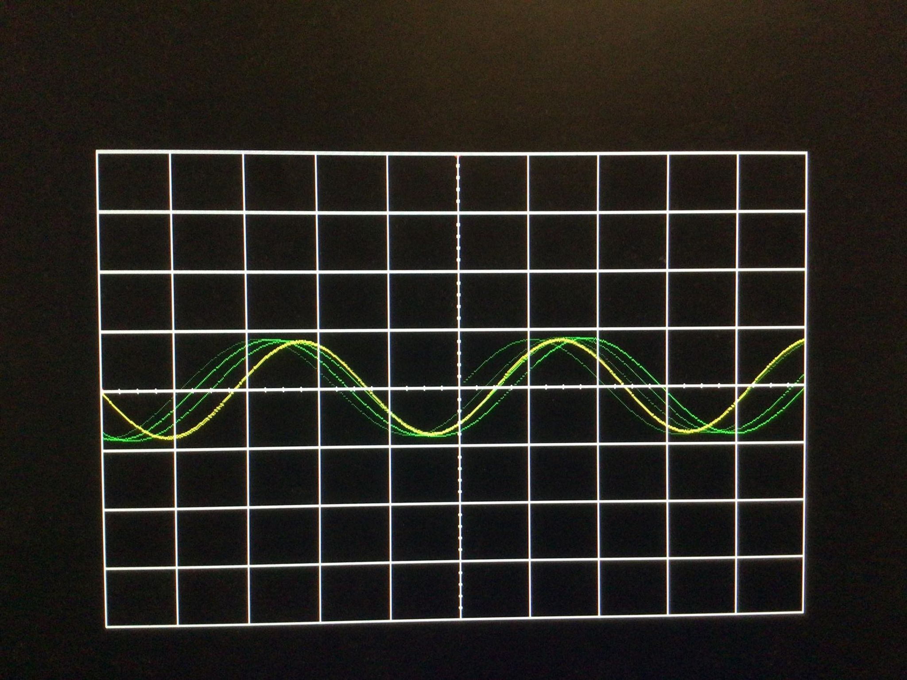

# Lab 2
## KokHwa Khor

## Table of Contents
1. [Objectives or Purpose](#objectives-or-purpose)
2. [Preliminary Design](#preliminary-design)
3. [Software flow chart or algorithms](#software-flow-chart-or-algorithms)
4. [Hardware schematic](#hardware-schematic)
5. [Debugging](#debugging)
6. [Testing methodology or results](#testing-methodology-or-results)
7. [Answers to Lab Questions](#answers-to-lab-questions)
8. [Observations and Conclusions](#observations-and-conclusions)
9. [Documentation](#documentation)

### Objectives or Purpose 
In this lab, the video display controller developed in Lab 1 was integrated with the audio codec on the Nexys Video board to build a basic 2-channel oscilloscope. The goal of this project was to take in audio signal from a 3.5mm jack, convert it, and display it on the screen.

### Preliminary design
#### [Video link showing functionality of scope face from lab 1 and audio loopback for gate check 1](https://youtu.be/eVa3r56AhqE)

#### Figure below shows BRAM write address increment and data be written/read from the BRAM. 

#### Figure 1: BRAM WRADD, Din, and readL increment

#### Figure below shows channel 1 values being updated properly when readL equals row.

#### Figure 2: Channel 1 going high and low

### Software flow chart
One of the most important entity in this lab was the datapath entity. It includes an audio codec wrapper that takes in signal from a 3.5mm jack and samples the audio into separate 18-bit 2's complement left and right channels. The data is then being passed into a BRAM to store the audio sample and being displayed by the video entity developed from lab 1. A counter that counts from 20 up to 1023 and resets is included for the address of the BRAM. A control unit entity is also included as a finite state machine for this lab.

### Hardware schematic
#### Figure below shows an updated block diagram for this lab.

#### Figure 3: Schematic for the design.

### Debugging
1. One of my main problem was getting the finite state machine right. Nothing was displaying on the screen at first, and it was hard to find out where exactly went wrong. Running simulations with testbenches for different entities really helps me to figured out that my finite state machine was wrong. That also brings it to my second problem.
2. I had no idea the simulations couldn't update properly without deleting the entire simulation files manually. That wasted a lot of time trying to figure out what exactly went wrong when the simulations weren't displaying the correct output for me to debug.

### Testing methodology or results
#### Figure below shows simulation of testbench for flagRegister.

#### Figure 4: flagRegister testbench simulation

#### Figure below shows simulation of testbench for control unit.

#### Figure 5: Control unit testbench simulation

#### Figure below shows data coming out of the audio codec (L_bus_out_s) and being converted from signed to unsigned (L_bus_out_unsigned) and into the BRAM (Din_s). To convert from signed to unsigned, 131072 decimals were added to it, which was equivalent to 100000000000000000. As shown in the figure below, L_bus_out_s 110111111011111101 was added 100000000000000000, hence L_bus_out_unsigned was 010111111011111101.

#### Figure 6: Audio Codec data being converted

#### Figure below shows the same data going into the BRAM was being output from the BRAM. As shown in figure below, data going in (Din_s) was the same as data coming out (readL) from the BRAM.

#### Figure 7: Same data going in and out from BRAM
[Video link showing functionality of channel 1](https://youtu.be/NCp-O8-WYyE)

### Final Result
#### Figure below shows the final result of both channel displaying on the oscilloscope

#### Figure 8: Final result of oscilloscope with both channel displaying.
[Video link showing final result of oscilloscope](https://youtu.be/QPuRMADnHno)

### Answers to Lab Questions
1. Each major division represent 1.21ms.
2. Each minor division represent 0.3ms. 
3. Figure below shows the same audio output captured using oscilloscope from the lab and oscilloscope that I built.

Figure 9: Audio output captured using oscilloscope from the lab

Figure 10: Audio output captured using oscilloscope that I built
The measured peak-to-peak voltage is 720mV. Comparing it to the waveform captured on the oscilloscope that I built from my display, both waveforms were pretty much similar. The peak-to-peak voltage was represent by 8 minor divisions as shown in Figures 9 and 10.
4. Approximately 20.9ms to fill the entire memory with audio samples.
5. It takes approximately 16.8ms to draw the whole display once.
6. V_sync was held low for approximately 0.06ms.

### Observations and Conclusions
An oscilloscope was built on a FPGA development board. I learned more about how a the BRAM works and how it stores data for the audio signal. A deeper understanding of finite state machine was achieved. I also learned that if the simulations is not working properly, deleting the entire simulation files and rerun it will fix the problem in Vivado. Overall, this lab was a success with all the functionalities achieved as shown in Figure 8 and the video under it. I don't find anything that really needs to be improved, but maybe if I knew that the simulation bugs earlier, that would save me quite some time.

### Documentation
This lab was done with the help of Professor Falkinburg, and code from Lecture 13 and Lab 1.