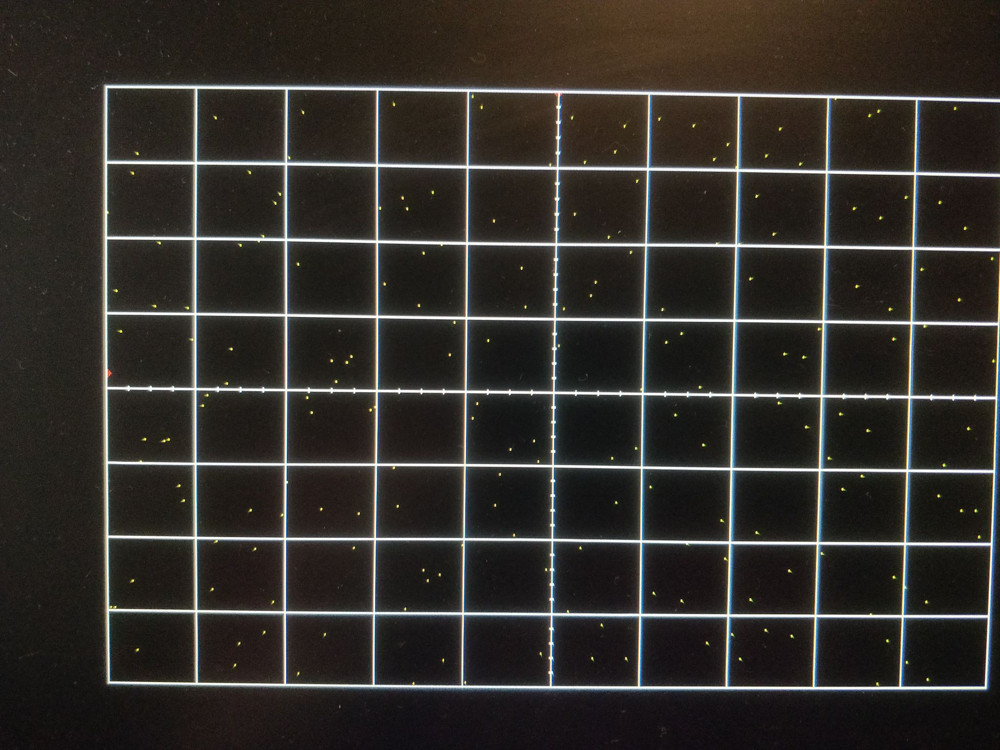

# Lab 3
## KokHwa Khor

## Table of Contents
1. [Objectives or Purpose](#objectives-or-purpose)
2. [Preliminary Design](#preliminary-design)
3. [Software flow chart or algorithms](#software-flow-chart-or-algorithms)
4. [Hardware schematic](#hardware-schematic)
5. [Debugging](#debugging)
6. [Testing methodology or results](#testing-methodology-or-results)
7. [Answers to Lab Questions](#answers-to-lab-questions)
8. [Observations and Conclusions](#observations-and-conclusions)
9. [Documentation](#documentation)

### Objectives or Purpose 
In this lab, the video display controller developed in Lab 2 was integrated with the MicroBlaze processor built using the fabric of the Artix-7 FPGA. A software controlled datapath was built using Vivado and SDK tool chains. Several functions were added to this lab to correct some shortcomings of oscilloscope from lab 2. Specifically, I added horizontal trigger point, ability to enable/disable channels being displayed, ability to trigger off of channel 2, and ability to change the slope direction of the trigger.

### Preliminary design
#### Gate Check 1
#### Pictures below showing functionality implemented with Microblaze. There's no default value for trigger time and trigger volt, and button signals were removed so no waveform were shown.

#### Figure 1: Gate Check 1 Oscope
#### Figure below shows a user menu was created through terminal using Tera Term.

#### Figure 2: Gate Check 1 USART Interface

#### Gate Check 2
#### Video below shows trigger time and trigger volt being moved using key switches through the terminal (Tera Term)
[Video link to Gate Check 2 functionality](https://youtu.be/7mF7QRb5scA)

### Software flow chart or algorithms
#### Figure below shows flow chart of how the array was read in, modified, and outputted to the hardware.

#### Figure 3: Software flow chart

### Hardware schematic
#### Figure below shows the draft of the hardware connection. Several signals were configurated and the connections were included in the table below.

#### Table 1: Signals connection

#### Figure 4: Hardware connection

### Debugging
1. One of my first main problem was to print out something on the oscilloscope. Specifically, I was trying to print out a straight line using external L bus. The problem that I had was not shifting the value that I'm trying to print, hence the value was too small to be shown on screen. Figure below shows a straight line was printed through the oscilloscope.

#### Figure 5: Straight line printed across on oscilloscope
2. The second major problem that I had was not being able to output the data from L/Rbus into the screen. Turns out the issue was within my vhdl code. When I was taking in L/R bus value from the hardware, I was taking the lower 16 bits instead of the top 16 bits. I also connected the wrong ready signal to the interrupt which caused my interrupt function to not work as how it should be. Figure below shows oscilloscope display when I was having the issue.

#### Figure 6: Pixels scattered all over the oscilloscope

### Testing methodology or results
#### Required Functionality
#### Picture below shows display memory of lab 2 component

#### Figure 3: Lab 2 component

#### Picture below shows channel 1 being triggered

#### Figure 4: Channel 1 being triggered

#### Picture below shows the user menu through the terminal

#### Figure 5: User menu through Tera Term

#### B-level Functionality
##### Ready bit of the flag to trigger an interrupt:
	--------------------------------------------------------------------
	--  Interrupt <= flagQ_s(2);
	------------------------------------------------------------------------- 
##### ISR storing left and right samples into two arrays, "dataMax" act as a flag to indiciate the array is full and the stored samples should be transferred to BRAM
	/*------------------------------------------------------------------------------------------
	void myISR(void) {
	  if (dataMax == 0)			// if array is not full, fill array with data
	  {
	    leftData[data_index] = Xil_In16(oscopeLbusOut);
	    rightData[data_index] = Xil_In16(oscopeRbusOut);
   	    data_index = data_index + 1;
	    if (data_index >= 1023)
	    {
		dataMax = 1;			// Stop filling data into the array once it's full
		data_index = 0;
	    }
	    Xil_Out8(oscopeFlag, 0x04);		// Clear the flag and then you MUST
	    Xil_Out8(oscopeFlag, 0x00);		// allow the flag to be reset later
	  }
	}
	------------------------------------------------------------------------------------------*/

#### A-level functionality
#### Pictures below show Channel 1 and channel 2 being disabled/enabled

#### Figure 6: Channel 1 disabled

#### Figure 7: Channel 2 disabled

#### Pictures below show channel 2 being triggered and changes rising edge or falling edge of the waveform

#### Figure 8: Channel 2 being triggered with Rising Edge

#### Figure 9: Channel 2 being triggered with Falling Edge

### Final Result
#### Video below shows the final result and all the functionalities implemented in this lab
[Video link showing final result](https://youtu.be/GgNKPbNcinc)

### Answers to Lab Questions
#### There were no question asked in this lab.

### Observations and Conclusions
Using Artix-7 FPGA, the video display controller was built. Vivado and SDK tool chains were used to achieve the goal of this lab. All the functionalities were met and recoreded. From this lab, I learnt how to implement a Microblaze to a hardware using NEXYS video board. Not having to keep changing the block diagram or vhdl code to debug made this lab way easier because debugging in C code takes a few seconds, whereas any changes made to block diagram or vhdl had to be regenerate bitstream and that takes like 20 to 25 minutes on my device. A deeper understanding of software control using Microblaze was achieved. This could be useful in the future when implementing a more complex design in a shorter period of time. Overall, this lab was a success with all the functionalities achieved as shown on the result section above. One skill that I learn from this lab was to fully understand how everything works, if not I'll just ended up wasting more time trying to complete the lab.

### Documentation
This lab was done with the help of Professor Falkinburg, and code from lecture 20 and lab 2.